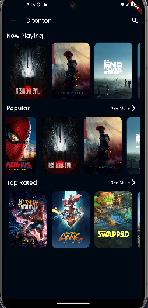
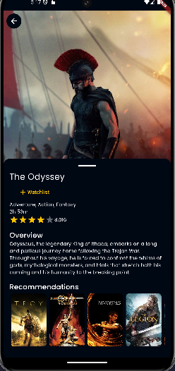
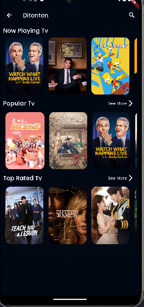
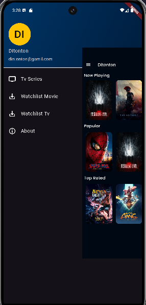

# Ditonton — Movie & TV Series Catalog

**Ditonton** is a Flutter app for browsing movies and TV series. It shows what is currently airing, what is popular and what is top rated, lets you open a title to see its details and similar recommendations, search for any movie or TV show, and save favorites to a personal watchlist that works offline.

All movie and TV data comes from [The Movie Database (TMDB) API](https://developer.themoviedb.org/). The project is built with **Clean Architecture** and is covered by **48 unit and widget test files**.

> Built as the project for Dicoding's *Menjadi Flutter Developer Expert* class, extended with a full TV series module.

---

## Screenshots

| Home (Movies) | Movie Detail | Home (TV Series) | Drawer Menu |
|:---:|:---:|:---:|:---:|
|  |  |  |  |

---

## Features

### Movies
- **Now Playing, Popular and Top Rated** lists on the home page, with a *See More* page for Popular and Top Rated
- **Movie detail** with poster, title, genres, duration, star rating, and overview
- **Recommendations** of similar movies on the detail page
- **Search** movies by title

### TV Series
- **Now Playing, Popular and Top Rated** TV series lists, each with a *See More* page for Popular and Top Rated
- **TV series detail** with genres, rating, overview, and recommendations
- **Search** TV series by title

### Watchlist
- Add or remove movies and TV series from the watchlist with one tap on the detail page
- Separate **Watchlist Movie** and **Watchlist TV** pages
- Stored locally with **SQLite**, so the watchlist is available without internet

### Other
- **Offline cache** for Now Playing movies: when there is no connection, the app shows the last cached list
- **Animated side drawer** that slides and scales the main page to reveal the menu
- Dark theme with a custom color palette and **Poppins** font

---

## Architecture

The code follows **Clean Architecture**, split into three layers so each part can be tested on its own:

```
lib/
├── common/          # constants, theme, failures, exceptions, network info
├── data/
│   ├── datasources/ # remote (TMDB API via http) and local (SQLite) data sources
│   ├── models/      # JSON models and database table models
│   └── repositories/# repository implementations
├── domain/
│   ├── entities/    # plain business objects (Movie, Tv, MovieDetail, ...)
│   ├── repositories/# abstract repository contracts
│   └── usecases/    # one class per action (GetNowPlayingMovies, SaveWatchlist, ...)
├── presentation/
│   ├── pages/       # screens
│   ├── provider/    # ChangeNotifier state management
│   └── widgets/     # reusable widgets (movie/tv card, custom drawer)
├── injection.dart   # dependency injection setup with get_it
└── main.dart
```

- **Data flow:** UI → Provider (ChangeNotifier) → Use Case → Repository → Remote / Local Data Source
- **Error handling:** repositories return `Either<Failure, T>` (from `dartz`), so every screen handles success, server error, connection error and cache error explicitly
- **Dependency injection:** all data sources, repositories, use cases and notifiers are registered in `injection.dart` with `get_it`

---

## Packages Used

| Package | Purpose |
|---|---|
| [provider](https://pub.dev/packages/provider) | State management with `ChangeNotifier` |
| [get_it](https://pub.dev/packages/get_it) | Dependency injection / service locator |
| [http](https://pub.dev/packages/http) | REST API calls to TMDB |
| [dartz](https://pub.dev/packages/dartz) | Functional error handling with `Either` |
| [equatable](https://pub.dev/packages/equatable) | Value equality for entities and models |
| [sqflite](https://pub.dev/packages/sqflite) | Local SQLite database for watchlist and cache |
| [path_provider](https://pub.dev/packages/path_provider) | Locating the database path on the device |
| [data_connection_checker](https://github.com/chornthorn/data_connection_checker) | Checking internet connection for offline cache |
| [cached_network_image](https://pub.dev/packages/cached_network_image) | Loading and caching poster images |
| [flutter_rating_bar](https://pub.dev/packages/flutter_rating_bar) | Star rating display on the detail page |
| [google_fonts](https://pub.dev/packages/google_fonts) | Poppins font for the app theme |
| [mockito](https://pub.dev/packages/mockito) + [build_runner](https://pub.dev/packages/build_runner) | Generating mocks for unit and widget tests |

---

## Testing

The project has **48 test files** covering every layer:

| Layer | What is tested |
|---|---|
| Data | Remote and local data sources, JSON models, repository implementations |
| Domain | All use cases (movies, TV series, search, watchlist) |
| Presentation | All providers (notifiers) and widget tests for list and detail pages |

Run the tests with coverage:

```bash
flutter test --coverage
```

---

## Getting Started

**Requirements:** Flutter SDK with Dart `>=2.12.0 <3.0.0` (null safety)

```bash
# 1. Clone the repository
git clone https://github.com/EkoBudi14/ditonton_project.git
cd ditonton_project

# 2. Install dependencies
flutter pub get

# 3. Run the app
flutter run
```

The TMDB API key is set in `lib/data/datasources/movie_remote_data_source.dart` and `lib/data/datasources/tv_remote_data_source.dart`. To use your own key, create one at [themoviedb.org](https://www.themoviedb.org/settings/api) and replace the `API_KEY` value in both files.

---

## Author

**Eko Budiarto** — Mobile Developer (Flutter & Android)
[GitHub](https://github.com/EkoBudi14) · [LinkedIn](https://www.linkedin.com/in/eko-budiarto-00/)
